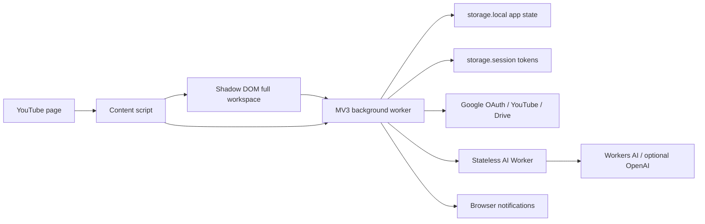

# Architecture



## Runtime boundaries

### Content script and workspace

`entrypoints/youtube.content.tsx` mount một Shadow DOM workspace trực tiếp dưới YouTube header, thêm left-navigation entry, scan metadata DOM và đánh dấu video click là watched.

Không có popup entrypoint. Toolbar action gửi `TOGGLE_PANEL` vào tab YouTube đang active.

YouTube selectors chỉ nằm trong `src/youtube/parser.ts`.

### Background worker

`entrypoints/background.ts` là nơi duy nhất mutate `AppState`. Typed messages nằm trong `src/domain/messages.ts`; mutation queue tránh action đồng thời ghi đè nhau.

Background xử lý:

- Groups, channel assignments, tags và watched/hidden state.
- DOM discovery merge và canonical channel migration.
- OAuth session, YouTube API, Drive sync và cloud adapters.
- Bulk unsubscribe tuần tự.
- Subscription sync hai phase: phase nhanh import subscriptions/channel metadata theo batch; phase nền dùng `browser.alarms` để enrich uploads playlists qua RSS/Data API.

OAuth tokens không bao giờ được gửi vào YouTube page context.

## Data sources

- DOM adapter: fallback/local discovery.
- YouTube API: subscriptions, canonical channels, uploads playlists và video details.
- Drive `appDataFolder`: groups/channels/videoStates snapshot.
- Cloud API: AI tags, AI groups, AI unsubscribe suggestions (stateless).

`Channel.id` từ DOM bắt đầu bằng `channel:`. Subscription sync chuyển sang canonical `UC...` ID khi exact custom URL/handle match, đồng thời rewrite group/video references.

## State

```text
AppState
├── groups[]
│   └── channelIds[]
├── channels[]
│   ├── subscriptionId
│   └── uploadsPlaylistId
├── videos[] (max 2,000)
├── videoStates[videoId]
└── settings
```

Google/Cloud tokens nằm ở `storage.session` riêng và không thuộc `AppState`, JSON export hoặc Drive snapshot.

Drive pull hiện dùng cloud-wins cho groups/channels/watched preferences. Trước auto-sync cần chuyển assignment thành entity riêng có `updatedAt`, `deletedAt`, `deviceId`.

## Feed pipeline

`selectFeed()` là pure function áp group, hidden, content type, duration, watched, search và sorting. API metadata có `publishedAt`; DOM-only metadata dùng `discoveredAt` fallback.

Connect Google và Sync YouTube không còn đợi fetch uploads playlist của từng channel. Sau khi subscription metadata được lưu, alarm `youtube-collections-enrichment` claim tối đa 10 channel rồi thả mutation queue ngay. YouTube API fetch chạy bên ngoài queue; chỉ bước merge kết quả vào storage là atomic/serialized. Vì vậy tạo/sửa/xóa/gán Group không bị chặn bởi network job.

Enrichment là progressive và per-channel:

- Chỉ channel chưa có dữ liệu hoặc `lastSuccessAt` quá 24 giờ được queue lại.
- Channel thuộc group vừa tạo/gán được đặt `priority` và xử lý trước.
- Trạng thái gồm `pending`, `loading`, `ready`, `error`; lỗi retry tối đa 3 lần với backoff 30s/60s/120s.
- Hết retry được xem là settled và hiển thị warning, không giữ global spinner ở `running` vô hạn.
- `settings.enrichmentCursor/enrichmentTotal` chỉ là summary tương thích UI; source of truth là `channel.enrichment`.
- Khi service worker/browser restart, `onStartup` khôi phục alarm nếu state còn việc retry/pending.

Feed group vẫn render cache ngay và chủ động fetch group khi được chọn. Background enrichment là prefetch/bổ sung metadata, không phải dependency của Group actions.

Thứ tự group dùng `Group.position`. Mọi màn hình điều hướng Feed sort tăng dần theo field này; thao tác ưu tiên trong tab Groups hoán đổi vị trí và chuẩn hoá lại toàn bộ dãy.

## Permissions

- `storage`: local/session state.
- `identity`: Google OAuth.
- `activeTab`: toggle workspace từ toolbar.
- `alarms`: background channel enrichment.
- `notifications`: group notifications.
- YouTube/Google host permissions: API calls từ background.
- Production Cloud host permission: giới hạn đúng `youtube-collections-cloud.qeoqeo.workers.dev`; không xin quyền động `https://*/*` từ content script.

Không dùng `webRequest`, eval hoặc remote code.

## Design system

Semantic tokens và component primitives nằm trong `src/ui/design-system.css`, theo visual language của TanStack Design System nhưng không dùng logo/trademark TanStack.
