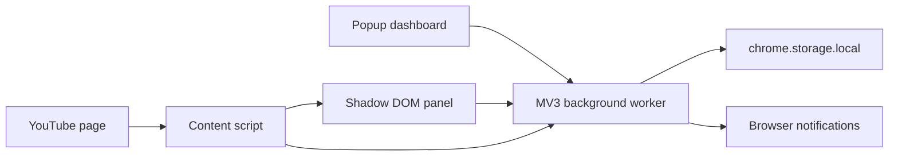

# Architecture

## Runtime surfaces



### Background worker

`entrypoints/background.ts` là nơi duy nhất mutate `AppState`. Popup và content script gửi typed message từ `src/domain/messages.ts`. Cách này tránh race condition khi hai UI cùng mở.

Background worker thực hiện:

- CRUD groups, group-channel assignments và channel tags.
- Merge các channel/video mới phát hiện.
- Watched/hidden state.
- Import/export state validation.
- Notification local và xử lý click notification.

### Content script

`entrypoints/youtube.content.tsx`:

- Mount React panel bằng WXT Shadow Root UI.
- Thêm entry vào YouTube left navigation.
- Theo dõi DOM bằng `MutationObserver` có debounce.
- Gọi `scanYouTubePage()` và gửi payload về background.
- Đánh dấu watched khi người dùng bấm video YouTube đã được cache.

Không đặt selector YouTube ở component React. Selector và metadata heuristics phải nằm trong `src/youtube/parser.ts`.

### Popup

Popup có bốn tab:

- Feed: dùng chung `FeedView` với YouTube panel.
- Groups: CRUD, icon, màu, notifications.
- Channels: many-to-many groups, tags, local cleanup.
- Settings: theme, hide watched, notifications, import/export/reset.

## State model

Toàn bộ state MVP được lưu tại key `youtube-collections-state-v1` trong `chrome.storage.local`.

```text
AppState
├── groups[]
│   └── channelIds[]
├── channels[]
├── videos[]              capped at 2,000
├── videoStates[videoId]
└── settings
```

Group-channel hiện lưu dưới dạng `Group.channelIds`. Khi chuyển sang cloud sync, nên migrate thành entity `GroupChannel` độc lập để conflict resolution theo từng assignment.

`Channel.id` trong local MVP được tạo từ pathname channel/handle. Khi có YouTube API, cần migrate sang canonical YouTube channel ID (`UC...`) và giữ alias map để không mất group assignment cũ.

## Feed pipeline

`selectFeed()` trong `src/domain/state.ts` là pure function:

1. Giới hạn theo group.
2. Loại video hidden.
3. Áp content type, duration và watched filter.
4. Áp tìm kiếm title/channel.
5. Sort.

Hàm được dùng bởi cả popup và content panel, đồng thời có unit tests.

## Design system

`src/ui/design-system.css` chứa semantic token và component primitives lấy cảm hứng từ TanStack Design System:

- Neutral surfaces, subtle borders, rounded cards.
- Cyan/violet accent.
- Light/dark semantic variables.
- Compact badges, inputs, pills và data-dense layouts.

Không sử dụng logo hoặc trademark TanStack. Các component thuộc codebase này, không phụ thuộc runtime vào website TanStack.

## Permissions

- `storage`: local state.
- `notifications`: notification cho group.
- Host `https://www.youtube.com/*`: content script.

Không dùng `tabs`, `webRequest`, quyền đọc toàn bộ website hay remote code.

## Migration strategy

`schemaVersion` hiện là `1`. Mọi thay đổi breaking phải:

1. Thêm migration pure function `vN -> vN+1`.
2. Chạy migration trong background trước khi trả `GET_STATE`.
3. Giữ fixture backup của phiên bản cũ trong test.
4. Không mutate trực tiếp file import trước khi validate.
