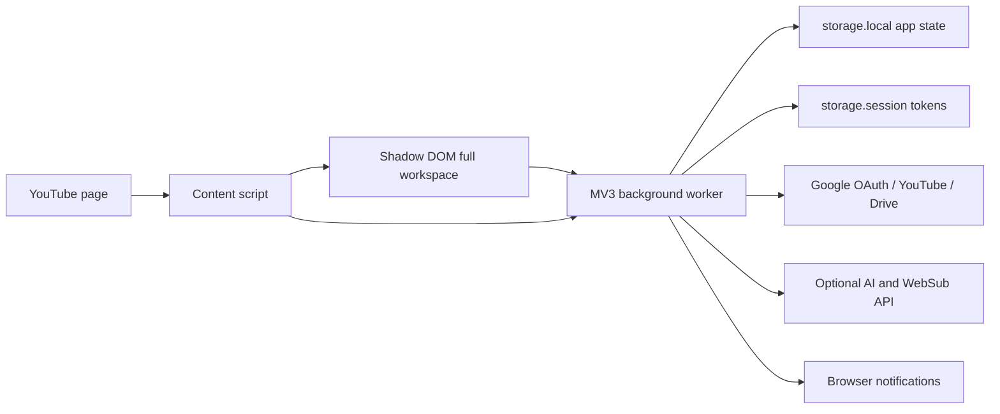

# Architecture



## Runtime boundaries

### Content script and workspace

`entrypoints/youtube.content.tsx` mount một Shadow DOM workspace trực tiếp dưới YouTube header, thêm left-navigation entry, scan metadata DOM và đánh dấu video click là watched.

Không có popup entrypoint. Toolbar action gửi `TOGGLE_PANEL` vào tab YouTube đang active.

YouTube selectors chỉ nằm trong `src/youtube/parser.ts`.

### Background worker

`entrypoints/background.ts` là nơi duy nhất mutate `AppState`. Typed messages nằm trong `src/domain/messages.ts`; mutation queue tránh action đồng thời ghi đè nhau.

Background xử lý:

- Groups, channel assignments, tags và watched/hidden state.
- DOM discovery merge và canonical channel migration.
- OAuth session, YouTube API, Drive sync và cloud adapters.
- Bulk unsubscribe tuần tự.
- Cloud event polling và notifications.

OAuth tokens không bao giờ được gửi vào YouTube page context.

## Data sources

- DOM adapter: fallback/local discovery.
- YouTube API: subscriptions, canonical channels, uploads playlists và video details.
- Drive `appDataFolder`: groups/channels/videoStates snapshot.
- Cloud API: AI tags, WebSub registration và event inbox.

`Channel.id` từ DOM bắt đầu bằng `channel:`. Subscription sync chuyển sang canonical `UC...` ID khi exact custom URL/handle match, đồng thời rewrite group/video references.

## State

```text
AppState
├── groups[]
│   └── channelIds[]
├── channels[]
│   ├── subscriptionId
│   └── uploadsPlaylistId
├── videos[] (max 2,000)
├── videoStates[videoId]
└── settings
```

Google/Cloud tokens nằm ở `storage.session` riêng và không thuộc `AppState`, JSON export hoặc Drive snapshot.

Drive pull hiện dùng cloud-wins cho groups/channels/watched preferences. Trước auto-sync cần chuyển assignment thành entity riêng có `updatedAt`, `deletedAt`, `deviceId`.

## Feed pipeline

`selectFeed()` là pure function áp group, hidden, content type, duration, watched, search và sorting. API metadata có `publishedAt`; DOM-only metadata dùng `discoveredAt` fallback.

## Permissions

- `storage`: local/session state.
- `identity`: Google OAuth.
- `activeTab`: toggle workspace từ toolbar.
- `alarms`: cloud event polling.
- `notifications`: group notifications.
- YouTube/Google host permissions: API calls từ background.
- Optional HTTPS host permission: chỉ Cloud API origin người dùng nhập và approve.

Không dùng `webRequest`, eval hoặc remote code.

## Design system

Semantic tokens và component primitives nằm trong `src/ui/design-system.css`, theo visual language của TanStack Design System nhưng không dùng logo/trademark TanStack.
